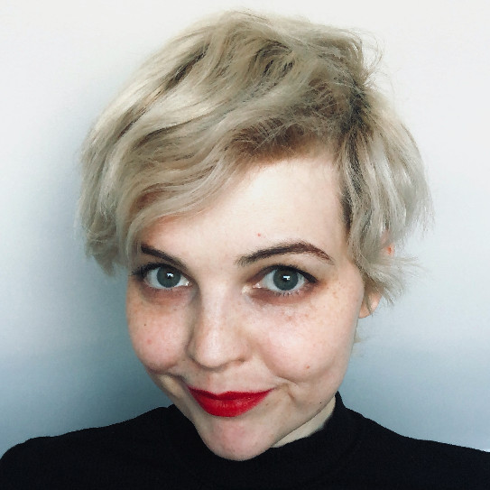

---
#
# By default, content added below the "---" mark will appear in the home page
# between the top bar and the list of recent posts.
# To change the home page layout, edit the _layouts/home.html file.
# See: https://jekyllrb.com/docs/themes/#overriding-theme-defaults
#
layout: home
---

 
<h3><i>Hi!</i></h3>

I am Aleksandra Samonek -- Ola for short -- a lawyer with over 17 years of experience in technology, data, and human rights. I have worked for the UN Refugee Agency (UNHCR) and the UN Children's Fund (UNICEF) on projects concerning the protection of refugees and migrants, refugee-led innovations, and humanitarian operations.

I hold an MA in Law from Jagiellonian University, where I studied the use of adaptive logics to represent courtroom processes, and a PhD in Political Science, which focused on human rights, with particular attention to the right to privacy in the context of surveillance and state security. I have served as an Assistant Professor at Adam Mickiewicz University in Poznań and as a researcher at Université catholique de Louvain (UCLouvain) and Jagiellonian University in Kraków. My current research focuses on externalization, asylum, and mixed migration movements.  

You can explore my <a href="\research">research publications</a> and <a href="\projects">projects</a> on their dedicated pages, and <a href="\blog">follow my blog, Borderlines</a>, for updates and insights.

For refugee-led and community-based organizations seeking support in designing, planning, or implementing innovations, I offer free mentoring sessions. Please contact me to inquire about available dates and times.

